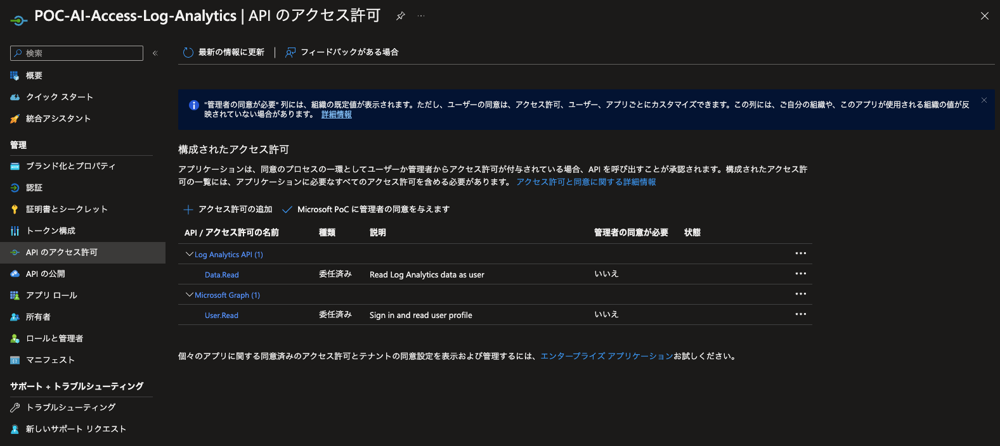

# ChatGPT + Enterprise data with Azure OpenAI and Cognitive Search

[](https://github.com/codespaces/new?hide_repo_select=true&ref=main&repo=599293758&machine=standardLinux32gb&devcontainer_path=.devcontainer%2Fdevcontainer.json&location=WestUs2)
[](https://vscode.dev/redirect?url=vscode://ms-vscode-remote.remote-containers/cloneInVolume?url=https://github.com/azure-samples/azure-search-openai-demo)


## Feature

- チャットと Q&A インターフェース
- 引用文、ソースコンテンツの追跡などを使用して、回答の信頼性を評価するためのさまざまなオプションを探る
- データの準備、プロンプトの構築、モデル（ChatGPT）とリトリーバー（Cognitive Search）の間のインタラクションのオーケストレーションのための可能なアプローチを示す
- UX で直接設定を変更し、動作を微調整しオプションを試す


## Getting Started

> **重要：** この例を展開して実行するには、**Azure OpenAI サービスへのアクセスが有効になっている Azure サブスクリプション**が必要です。アクセスをリクエストするには、[こちら](https://aka.ms/oaiapply)をクリックしてください。また、[こちら](https://azure.microsoft.com/free/cognitive-search/)でいくつかの無料の Azure クレジットを入手して始めることもできます。

> **Azure リソースのコスト** このサンプルでは、デフォルトで月額費用が発生する Azure App Service と Azure Cognitive Search リソース が作成されます。これらのコストを回避するためには、infra フォルダー内のパラメーターファイルを変更して、それぞれの無料バージョンに切り替えることができます（ただし、いくつかの制限があります。たとえば、1 つの Azure サブスクリプションにつき無料の Cognitive Search リソースは 1 つまでになります）。

### Prerequisites

#### クライアントアプリの登録

Azure にクライアントアプリの登録を行い、シークレットを作成します。
また、以下のように Log Analytics API に対する Data.Read 権限を付与します。



#### .env ファイルの追加

/app/backend に .env ファイルを作成して以下のように設定を行います。

- CLIENT_ID: 登録したクライアントアプリの ID
- CLIENT_SECRET: 登録したクライアントアプリのシークレット
- WORKSPACE_ID: Sentinel に紐付いている Log Analytics Workspace の ID

```.env
CLIENT_ID = "xxxx"
CLIENT_SECRET = "xxxx"
WORKSPACE_ID = "xxxx"
```

#### ローカル実行

- [Azure Developer CLI](https://aka.ms/azure-dev/install)
- [Python 3+](https://www.python.org/downloads/)
  - **重要**: Python と pip パッケージマネージャーは、Windows でセットアップスクリプトが動作するためにパスに含まれている必要があります。
  - **重要**: コンソールから `python --version` を実行できることを確認してください。Ubuntu の場合は、`python` を `python3` にリンクさせるために `sudo apt install python-is-python3` を実行する必要があるかもしれません。
- [Node.js](https://nodejs.org/en/download/)
- [Git](https://git-scm.com/downloads)
- [Powershell 7+ (pwsh)](https://github.com/powershell/powershell) - Windows ユーザーのみ。
  - **重要**: PowerShell コマンドから `pwsh.exe` を実行できることを確認してください。これが失敗する場合は、PowerShell をアップグレードする必要がある可能性があります。

> 注意: Azure アカウントには、[ユーザーアクセス管理者](https://learn.microsoft.com/azure/role-based-access-control/built-in-roles#user-access-administrator) や [所有者](https://learn.microsoft.com/azure/role-based-access-control/built-in-roles#owner) など、`Microsoft.Authorization/roleAssignments/write` の権限が必要です。

[](https://github.com/codespaces/new?hide_repo_select=true&ref=main&repo=599293758&machine=standardLinux32gb&devcontainer_path=.devcontainer%2Fdevcontainer.json&location=WestUs2)
[](https://vscode.dev/redirect?url=vscode://ms-vscode-remote.remote-containers/cloneInVolume?url=https://github.com/azure-samples/azure-search-openai-demo)

### インストール

#### プロジェクトの初期化

1. 新しいフォルダを作成し、ターミナルで移動します。
1. `azd auth login` を実行します。
1. `azd init -t azure-search-openai-demo` を実行します。
   - 対象の場所には、現在このサンプルで使用されているモデルをサポートしている地域である **East US** または **South Central US** を選択します。地域とモデルの最新のリストについては、[こちら](https://learn.microsoft.com/en-us/azure/cognitive-services/openai/concepts/models)を確認してください。

#### リソースの作成から始める場合:

既存の Azure サービスがなく、新しい展開から始めたい場合は、次のコマンドを実行します。

1. `azd up` を実行します。これにより、Azure リソースがプロビジョニングされ、このサンプルが `./data` フォルダ内のファイルに基づいてこれらのリソースに展開され、検索インデックスが構築されます。
1. アプリケーションが正常に展開されたら、コンソールに URL が表示されます。その URL をクリックしてブラウザでアプリケーションと対話します。

次のようになります:


#### 既存のリソースを利用する場合：

1. `azd env set AZURE_OPENAI_SERVICE {既存の OpenAI サービス名}` を実行します。
1. `azd env set AZURE_OPENAI_RESOURCE_GROUP {OpenAI サービスが提供される既存のリソースグループ名}` を実行します。
1. `azd env set AZURE_OPENAI_CHATGPT_DEPLOYMENT {既存の ChatGPT デプロイメントの名前}` を実行します。ChatGPT のデプロイメントがデフォルトの'chat'でない場合のみ必要です。
1. `azd env set AZURE_OPENAI_GPT_DEPLOYMENT {既存の GPT デプロイメントの名前}` を実行します。ChatGPT のデプロイメントがデフォルトの「davinci」でない場合のみ必要です。
1. `azd up` を実行します。

> 注：既存の Search と Storage Accounts を使用することもできます。 既存のリソースを設定するために `azd env set` に渡す環境変数のリストについては `./infra/main.parameters.json` を参照してください。

#### ローカルクローンのデプロイや再デプロイを行う：

- `azd up` を実行します。

#### ローカルで実行する：

1. `azd login` を実行する。
2. dir を `app` に変更する。
3. `./start.ps1` または `./start.sh` を実行するか、"VS Code Task "を実行します。

### Quickstart

- Azure の場合：azd によってデプロイされた Azure WebApp に移動してください。URL は azd の完了時に出力される（"Endpoint "として）か、Azure ポータルで見つけることができます。
- ローカルで実行する場合：127.0.0.1:5000 を開きます。

## Resources

- [Revolutionize your Enterprise Data with ChatGPT: Next-gen Apps w/ Azure OpenAI and Cognitive Search](https://aka.ms/entgptsearchblog)
- [Azure Cognitive Search](https://learn.microsoft.com/azure/search/search-what-is-azure-search)
- [Azure OpenAI Service](https://learn.microsoft.com/azure/cognitive-services/openai/overview)
